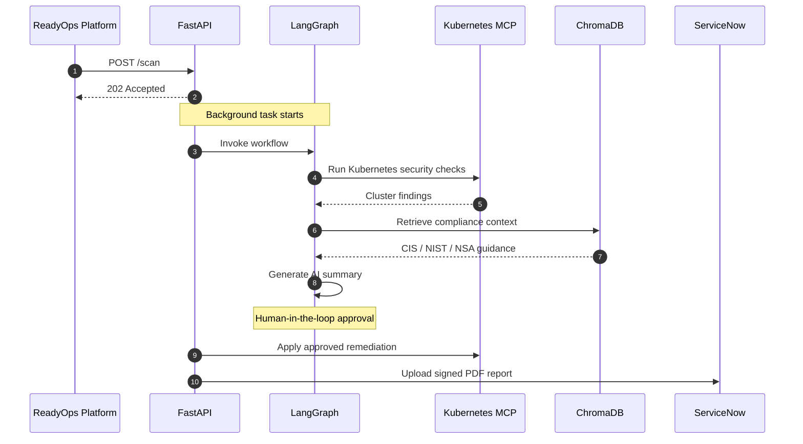
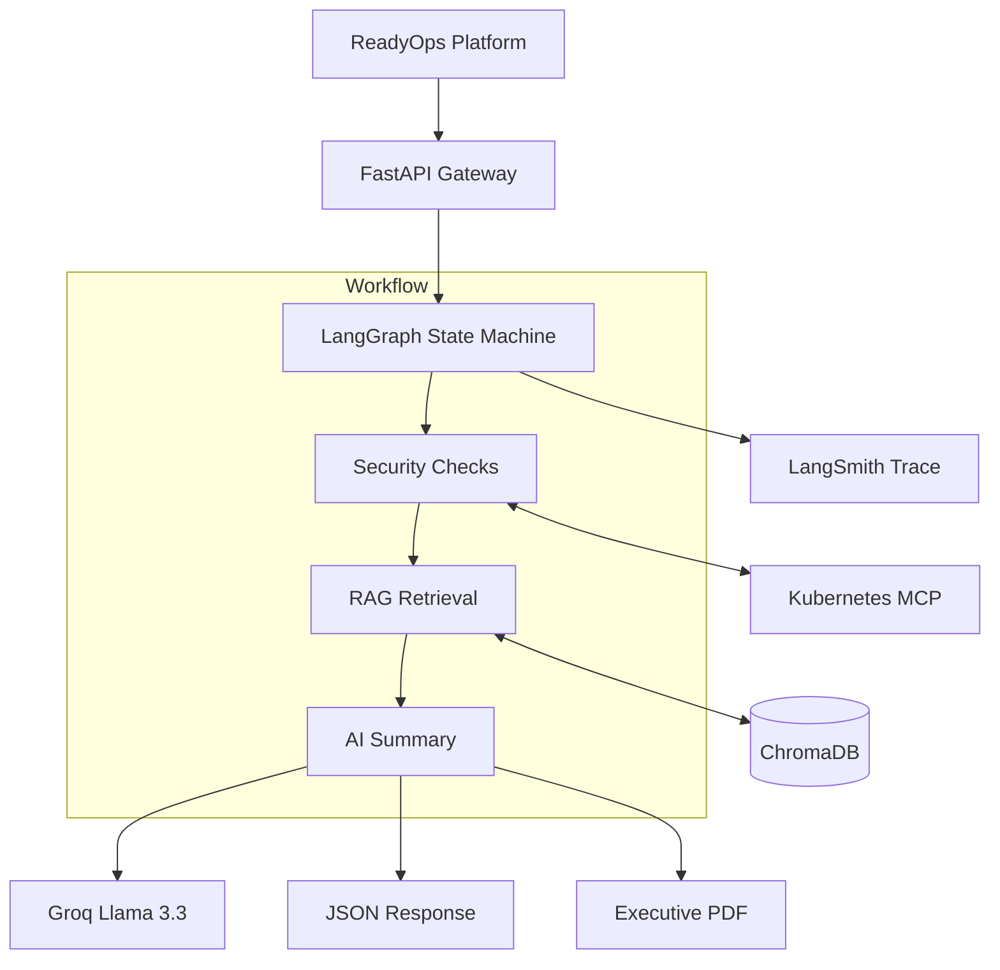

# 🦅 Compliance Claw

<p align="center">
  
  
  
  
</p>

> **Cisco Live Demo • Agent #20 • ReadyOps Platform Integration**

An enterprise-grade autonomous security compliance agent engineered for the **Criterion Networks ReadyOps Platform**. **Compliance Claw** automatically audits Kubernetes clusters, maps findings against leading security frameworks using a high-performance **ChromaDB RAG pipeline**, generates AI-powered remediation guidance, and produces executive-ready compliance reports.

---

## 🎪 Cisco Live Showcase Overview

This repository serves as the official integration blueprint for **Agent #20** within the Criterion Networks ecosystem. It demonstrates how autonomous AI agents bridge cloud-native infrastructure engineering and enterprise security governance during live platform demonstrations.

---

## 🎮 Live Demo Workflow



---

## 🏗️ System Architecture



---

## 💻 Technical Stack

| Layer | Technology | Purpose |
|-------|------------|---------|
| Agent Framework | LangGraph | Workflow orchestration |
| LLM | Groq Llama 3.3 70B | AI reasoning |
| Vector Database | ChromaDB | Semantic retrieval |
| Embeddings | sentence-transformers | Document embeddings |
| Cluster Access | Kubernetes MCP | Secure Kubernetes access |
| API | FastAPI + Uvicorn | Backend service |
| Observability | LangSmith | Execution tracing |
| Reports | ReportLab | PDF generation |

---

## 📂 Project Structure

```text
compliance-agent/
├── .github/
│   └── workflows/
│       └── ci.yml
├── agents/
│   └── compliance_agent.py
├── tools/
│   └── kubernetes_tools.py
├── rag/
│   ├── ingest.py
│   └── retriever.py
├── reports/
│   └── pdf_generator.py
├── data/
│   ├── cis_k8s.pdf
│   ├── nist_800_53.pdf
│   └── nsa_k8s.pdf
├── main.py
├── mcp_tools.py
├── Dockerfile
├── docker-compose.yml
└── requirements.txt
```

---

## 🛠️ Installation

### Clone Repository

```bash
git clone https://github.com/yajushivudatha/compliance-agent.git
cd compliance-agent
```

### Create Virtual Environment

```bash
python -m venv venv

# Windows
.\venv\Scripts\activate

# Linux/macOS
source venv/bin/activate
```

### Install Dependencies

```bash
pip install -r requirements.txt
```

### Configure Environment

Create a `.env` file:

```env
GROQ_API_KEY=

LANGCHAIN_API_KEY=
LANGCHAIN_TRACING_V2=true
LANGCHAIN_PROJECT=compliance-agent

USE_MOCK_DATA=false
K8S_MCP_URL=http://localhost:8080/sse
READYOPS_TOKEN=
```

### Build Vector Database

```bash
python rag/ingest.py
```

### Test the Agent

```bash
python agents/compliance_agent.py
```

### Run the API

```bash
uvicorn main:app --reload --port 8000
```

---

## 🐳 Docker

```bash
docker compose up -d --build
```

The container runs as a non-root user and includes health checks for production deployment.

---

## 📡 API Reference

| Method | Endpoint | Authentication | Description |
|---------|----------|----------------|-------------|
| GET | `/` | Public | API information |
| GET | `/health` | Public | Health check |
| POST | `/scan` | `X-ReadyOps-Token` | Start a compliance scan |
| GET | `/scans` | `X-ReadyOps-Token` | List scan history |
| GET | `/report/{scan_id}/pdf` | `X-ReadyOps-Token` | Download report |

### Trigger a Scan

```bash
curl -X POST http://localhost:8000/scan \
-H "Content-Type: application/json" \
-H "X-ReadyOps-Token: your-platform-secret-token" \
-d '{
  "cluster_name":"criterion-k8s",
  "triggered_by":"readyops-platform"
}'
```

### Sample Response

```json
{
  "scan_id": "SCAN-20260523-094724",
  "status": "NON-COMPLIANT",
  "total_passed": 11,
  "total_failed": 14,
  "compliance_score": 44,
  "cluster_name": "criterion-k8s",
  "pdf_download_url": "/report/SCAN-20260523-094724/pdf"
}
```

---

## 📸 Presentation Visuals

| ReadyOps Dashboard | LangSmith Trace | Executive PDF |
|--------------------|-----------------|---------------|
| *(Add screenshot)* | *(Add screenshot)* | *(Add screenshot)* |

---

## 📚 Compliance Standards

- CIS Kubernetes Benchmark v2.0.0
- NIST SP 800-53 Revision 5
- NSA/CISA Kubernetes Hardening Guide

---

## 👨‍💻 Project Ownership

**Developer:** Yajushi Vudatha

**Role:** Summer Intern

**Organization:** Criterion Networks

**Assignment:** Agent #20 — ReadyOps Platform Integration Suite (Cisco Live Production Build)
